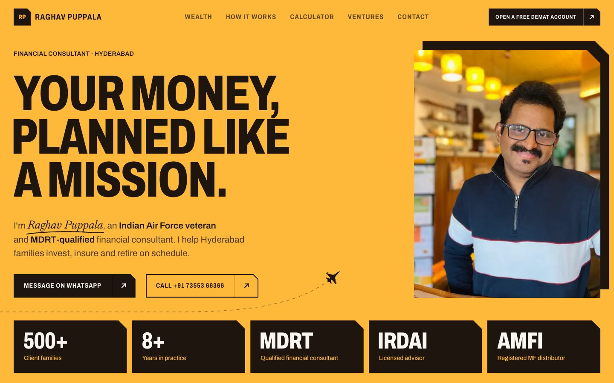

# Raghav Puppala

The website of **Raghav Puppala**, an Indian Air Force veteran and MDRT-qualified financial consultant in Hyderabad. It's a single page that leads with his wealth practice (investments, insurance and retirement planning) and then introduces his three ventures: AdsXcell, SP Design Studio and the HridaySpandana Foundation.

It replaces the current site at [raghavpuppala.com](https://raghavpuppala.com).




## Highlights

- **A page planned like a flight.** A jet takes off from the credentials in the hero, flies a dashed route through "How it works", and lands on a runway in the contact section.
- **Runway-lights preloader.** Threshold bars light up as the fonts, portrait and page actually load. It shows once per browser session.
- **Sections that hold their ground.** Key sections pin while their content builds in, and the ventures stack like sheets, each sliding over the last.
- **Corner-cut transitions.** Every section enters and leaves along a 45° cut from its trimmed top-right corner, and its headlines break into noise at the moving edge.
- **A footer you uncover.** The page lifts off the footer at the end, then holds while the wordmark assembles letter by letter.
- **SIP calculator.** Live projection of a monthly SIP, with the chart tweening between scenarios.
- **Typographic care.** Display headings are optically aligned using each line's first-glyph side bearing, and quote marks hang in the margin.
- **Responsive and accessible.** Layouts tuned from small phones to short laptop screens, a full reduced-motion fallback, and server-rendered content that never depends on an animation running.

## Tech stack

| | |
| --- | --- |
| Framework | Next.js 16 (App Router), React 19, statically prerendered |
| Language | TypeScript |
| Styling | Tailwind CSS v4 with OKLCH colour tokens; Archivo and Newsreader via `next/font` |
| Motion | GSAP 3 (ScrollTrigger, SplitText, DrawSVG, MotionPath, ScrambleText) with Lenis smooth scrolling |

## Getting started

Requires Node.js 20.9 or later.

```bash
npm install
npm run dev
```

Then open [http://localhost:3000](http://localhost:3000).

| Command | What it does |
| --- | --- |
| `npm run dev` | Start the development server |
| `npm run build` | Create a production build |
| `npm start` | Serve the production build |
| `npm run lint` | Lint with ESLint |

## Project structure

```text
src/
├── app/                page order, root layout, fonts and global styles
├── content/
│   └── site.ts         every word, number and link on the site
├── components/
│   ├── layout/         header and mobile menu, footer, preloader, and the motion shared by every section
│   ├── sections/       the page sections, in order, plus parts used by one section only
│   └── ui/             shared building blocks: Button, Headline, the jet artwork
└── lib/                GSAP setup, nav scrolling, optical alignment, number formatting
public/
└── raghav-puppala.jpg  the portrait
```

| Component | Role |
| --- | --- |
| `Hero`, `Credentials` | Headline, portrait, jet route and the credential plates |
| `Practice` | Wealth practice: investments, insurance, retirement, and the insurers he's appointed with |
| `FlightPlan` | How it works: brief, plan, review |
| `SipCalculator` | The SIP projection tool |
| `Testimonial` | Client quotes on a timed loop |
| `Ventures` | AdsXcell, SP Design Studio and HridaySpandana as stacked sheets |
| `Contact`, `JetLanding` | Ways to reach him, and the runway landing |
| `Preloader` | Runway-lights loader, once per session |
| `Cuts` | Each section's corner-cut entry and exit |
| `Flourishes` | Trimmed corners folding in and ruled lines drawing in |
| `OpticalAlign` | Pulls large headings back by their first glyph's side bearing |
| `SmoothScroll` | Lenis driven by GSAP's ticker, so smooth scrolling and ScrollTrigger share one clock |

## Editing content

All copy lives in [`src/content/site.ts`](src/content/site.ts): contact details and hours, credentials, the practice areas and insurer appointments, testimonials, the ventures, and the disclaimer. Components only read from it, so content changes never need a component edit.

The portrait is `public/raghav-puppala.jpg` (1600px wide). The original 12MB PNG is in the repository's first commit if a larger export is ever needed.

## Motion and accessibility

- All motion is gated behind `prefers-reduced-motion: no-preference`. With reduced motion there's no preloader, sections don't cut in or out, the ventures stack as plain panels, and smooth scrolling is off.
- Everything is server-rendered in its final state first, and intro elements reveal themselves after a few seconds if scripts never run.
- Hover effects are reserved for feedback on links and buttons.
- Every link, including the footer credit, is reachable by keyboard.
- Screens 1024px and wider but no taller than 820px (landscape tablets, 13-inch laptops) get a tighter `short:` layout, so pinned sections always fit on one screen.

## Before launch

- [ ] Add the AMFI ARN number to the disclaimer in `site.ts`. AMFI requires distributors to display it.
- [ ] Confirm the office days (the site says Monday to Friday).
- [ ] Confirm whether AdsXcell still offers bulk voice calls (left off the AdsXcell panel for now).
- [ ] Point raghavpuppala.com at this build.

## Credits

Designed and built by [Abhiraman Kuntimaddi](https://abhiramankuntimaddi.com). Content and photography © Raghav Puppala.
